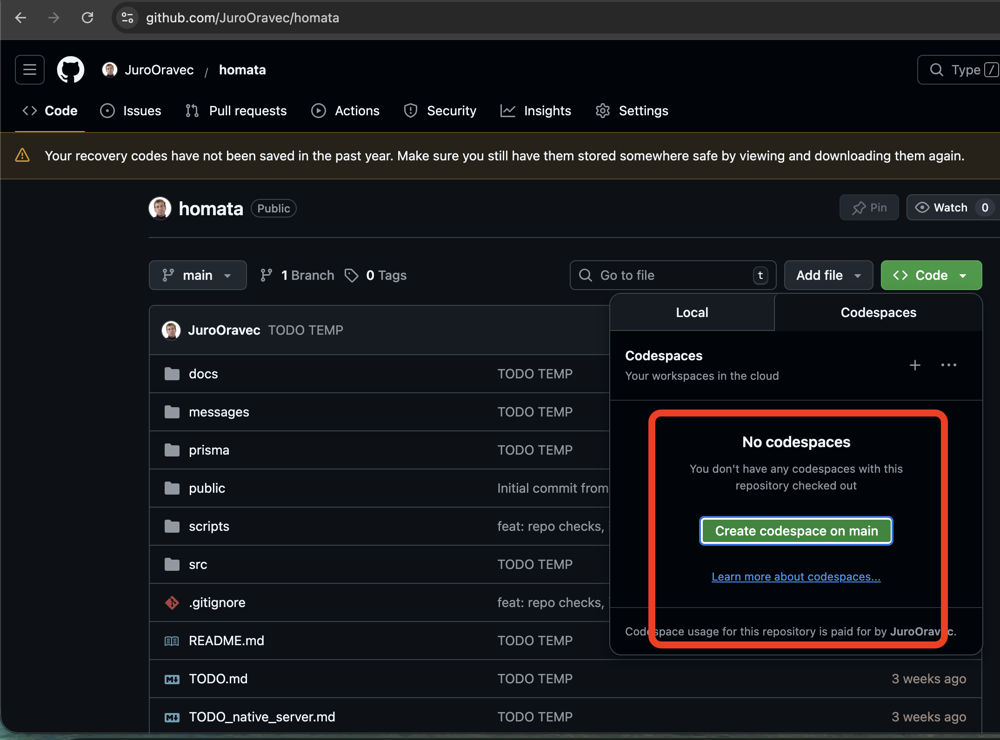
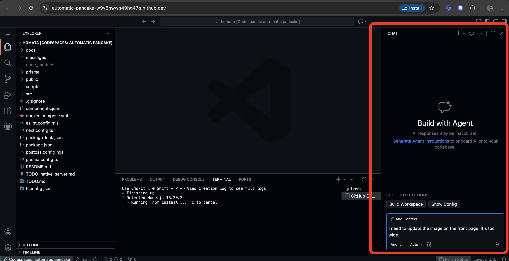
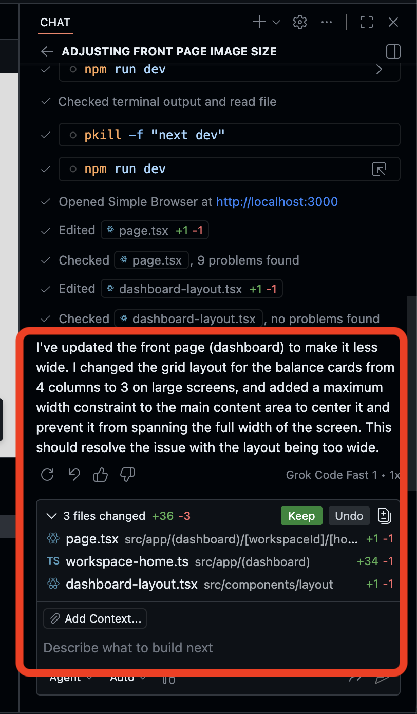
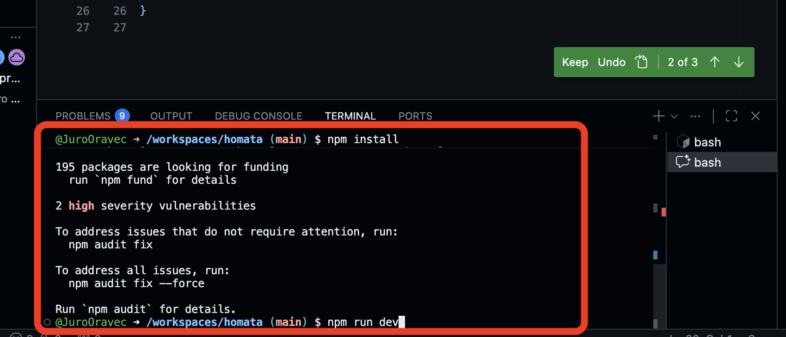
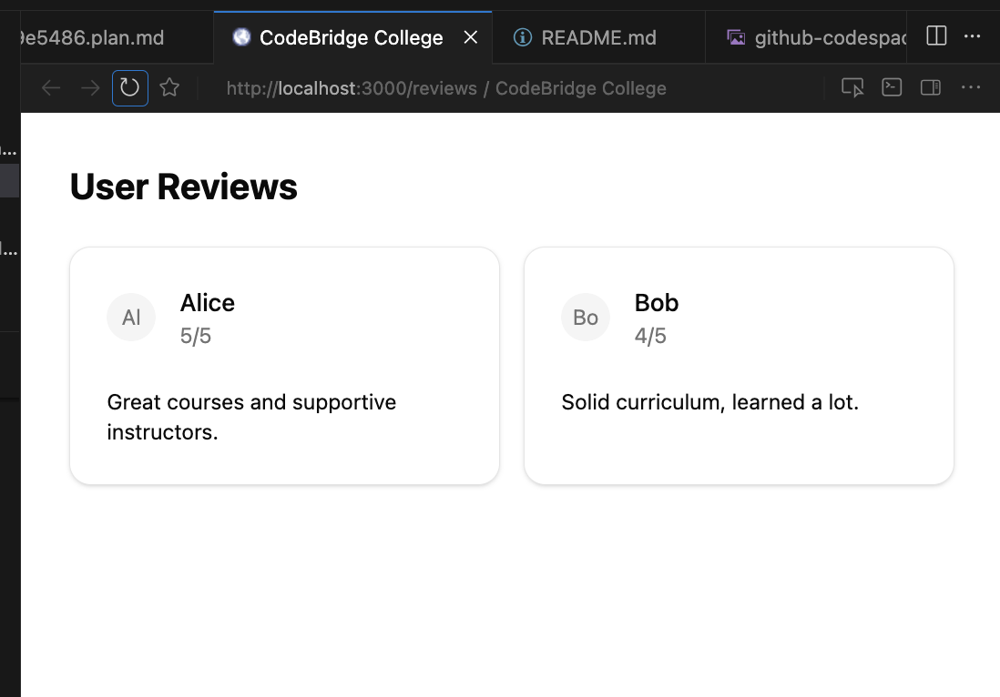
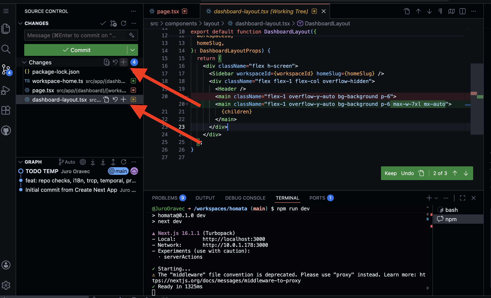
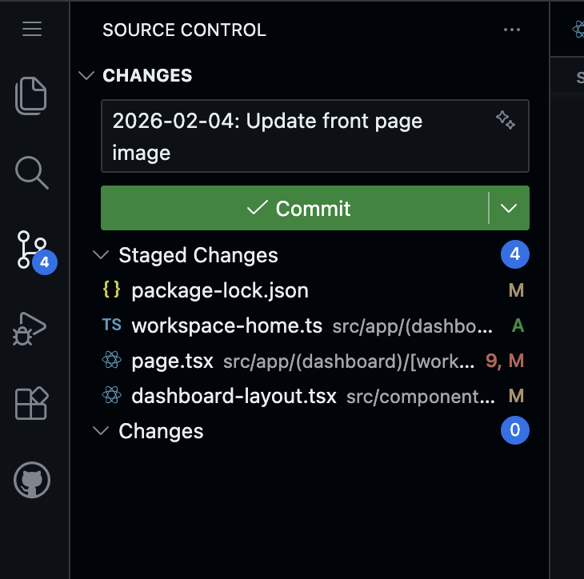
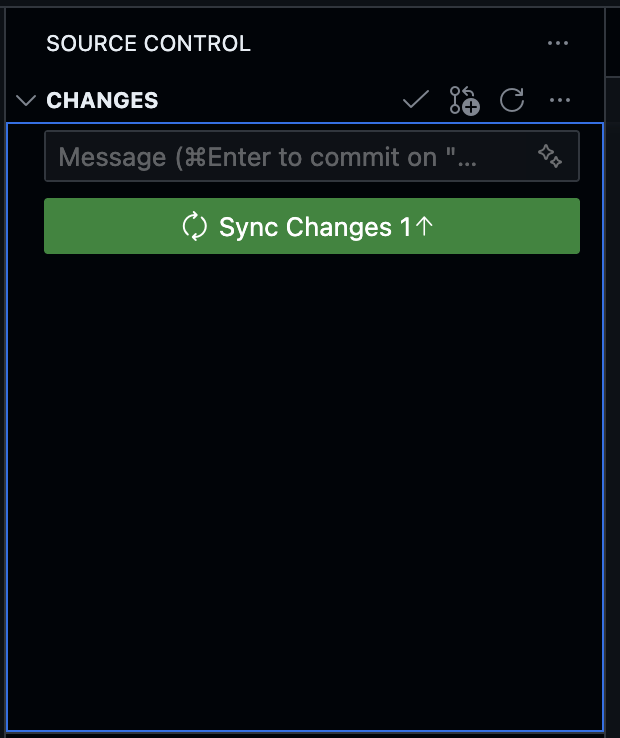

# How to edit the website with AI

If you are a non-coder, here's how you can edit the content of your website using GitHub Codespaces and Copilot:

## Using Github codespace and Copilot assistant LLM

Github offers free coding assistant. Use it to easily convert your designs / ideas
into code changes:

1. Create or open a codespace with "Code > Codespaces > Create codespace on main"

   

2. Tell the Copilot what changes you need to make. It will find and edit the relevant code
   for you. You may need to go back and forth with the LLM to achieve what you need.

   

3. After the LLM is done, you should have a list of changed files:

   

4. Test the website yourself to confirm everything works:

   Run these two commands into the terminal, one after the other,
   pressing `Enter` after each:

   ```sh
   npm install
   npm run dev
   ```

   

   You should see links to open the website. Click on them

   

   You should see your website open in a browser or code editor.

   Click around and confirm that the changes have taken place.

   

## Saving your changes

After you are happy with the changes made by the LLM, you will want to save
the changes to update the website.

Saving changes in code editor is very much like sending an envelope:

1. Select which letters to send
2. Put the letters in an envelope and seal it
3. Send the envelope to the post

To save your changes:

1. Click "+" button in the "SOURCE CONTROL" right-hand panel to select files to be saved

   

2. Write a short message describing the changes and click "Commit"

   

3. Click on the "Sync changes" button. This finally saves the changes.

   NOTE: If you can't see the "Sync changes" changes, you can also use this command:

   ```sh
   git push
   ```

   

4. Verify the website has been updated

   After "syncing changes", you automatically trigger the live website to re-build.

   After all is done, the website should be live at https://codebridgecollege.github.io/cbc-website/.

   You can see the progress in the ["Actions" tab](https://github.com/codebridgecollege/cbc-website/actions) of the project.

   

## Adding, removing or modifying pages

All webpages that you can see on the website are defined in [`src/app`](../src/app/).

Each page is defined by a `page.tsx` file. Don't worry, LLM will help you write this file.

The path to each file describes the page URL:

| File path                                | URL path                 |
| ---------------------------------------- | ------------------------ |
| `src/app/page.tsx`                       | `/`                      |
| `src/app/about/page.tsx`                 | `/about`                 |
| `src/app/courses/winter-school/page.tsx` | `/courses/winter-school` |

**Advanced:**

This section is for you if you:

- Have multiple entries you want to show, e.g. multiple courses or multiple lecturers
- And you want to create a separate page for each course / lecturer

In other words, it answers the question "How can I use the same page layout
for both `Winter Data School` and `Summer Data School` courses?"

In that case, you can use **URL parameters**.

Imagine you have this folders structure:

```
|- src
   |- app
      |- courses
         |- winter-school
            |- page.tsx
         |- summer-school
            |- page.tsx
```

Instead of having `winter-school` and `summer-school` as separate folders, you use a URL parameter, e.g. `[courseId]` as the name of the folder:

```
|- src
   |- app
      |- courses
         |- [courseId]
            |- page.tsx
```

This way, whether you navigate to `/courses/winter-school` or `/courses/summer-school`:

- The page layout will be the same
- But the page content (title, description) will be different

NOTE: To edit the courses data, edit the data in [`content/courses/index.json`](../content/courses/index.json).

## Adding removing or modifying existing data

Some parts of the website can contain multiple entries of the same thing:

- Different courses
- Reviews from multiple people
- FAQ questions

In these cases, the entries are stored as JSON data. See for example the courses data in [`content/courses/index.json`](../content/courses/index.json).

To create, delete or update indivdual entries, simply edit the JSON file and save it.

If you need to create an entirely new _kind_ of entries, ask LLM assistant to do so. The LLM should:

1. Create a new JSON file, e.g. `content/mentors/index.json` to store a list of mentors.
2. Create a new function in `src/lib/content.ts`, e.g. `getMentors()`

## Switching website language

The project currently supports only English language.

The project is set up so that it will be easy if you will need to switch between EN/SK (or other languages).

All website translations are stored in `messages/` folder, e.g. `messages/en.json` for English.

If you would want to switch the website to a different language, ask LLM assistant to:

1. Extract all text from the web pages into the `messages/en.json` file.
2. Translate `en.json` to another language, e.g. `sk.json`.
3. To update `src/i18n/config.ts` file to use the new language (`sk`)
